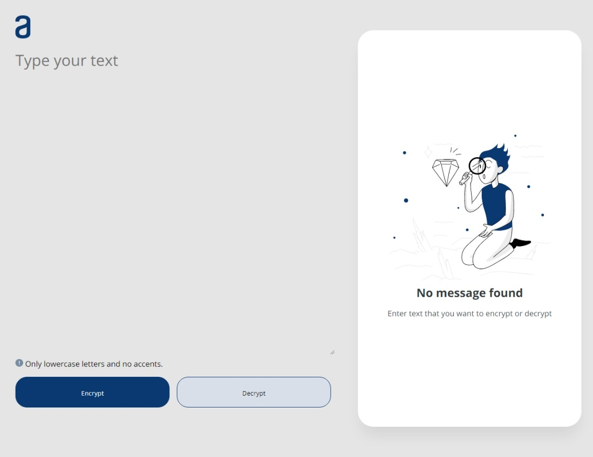
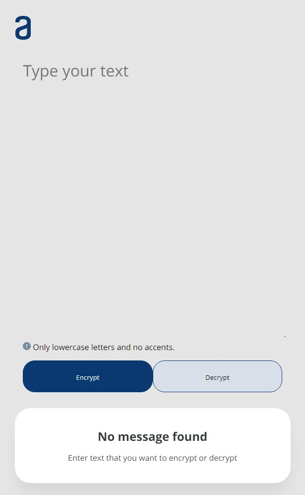
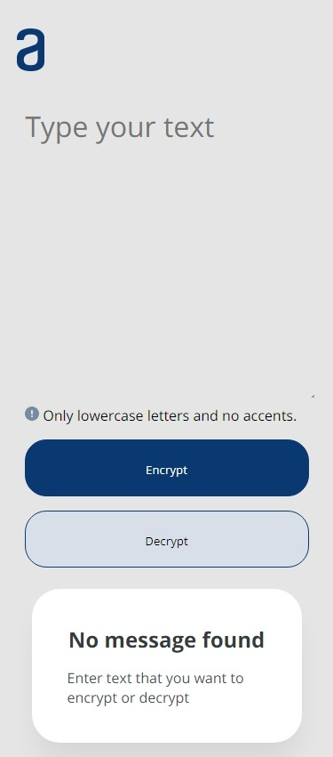

# Decoder &nbsp; &nbsp; &nbsp;  &nbsp; 

An application that encrypts texts, so you can exchange secret messages with other people who know the secret of the encryption used.

Total Spent Time: 3h

<b>Build with:</b> <br />


## Table of contents
- [Overview](#overview)
    - [The Challenge](#the-challenge)
    - [Project Composition](#project-composition)
    - [Screenshot](#screenshot)
    - [Links](#links)
- [My Process](#my-process)
    - [Build with](#build-with)
    - [What I learned](#what-i-learned)
- [Author](#author)

## Overview

### The Challenge
Build an responsive application that encrypt the entered text considering the predefined encryption dictionary. If the entered text contains special characters or capital letters, you should ask to review the text and make it possible to copy the encryption result with a button.

### Project Composition
- Check for special characteres and capital letters and disable buttons if entered invalid text.
- Encrypt the text entered with clicking the `encrypt` button
- Decrypt the text entered with clicking the `decrypt` button
- Copy the encryption result with a button `Copy`

### Screenshot

<p align="center">
    
</p>

<details>
    <summary>More</summary>

<p align='center'>
    
    
</p>
</details>

### Links

- Solution URL: [Git Hub](https://github.com/bemibrando/decoder)
- Live Site URL: [Git Hub Pages](https://bemibrando.github.io/decoder)

## My Process

### Build with
- HTML5
- CSS3
- JavaScript

### What I Learned
- To copy text to clipboard, previously was used the command `document.execCommand()`, but that got depreciated. But now it's possible to use the Clipboard API.

``` JavaScript
function myFunction(){
    // Get the text value
    let text = document.getElementById('toCopy').value;

    // Copy to clipboard
    navigator.clipboard.writeText(text);
}
```

## Author
<div sytle="display: inline-block;">
    <figure>
        <a href="https://github.com/bemibrando" target="_blank">
             <br />
            <sub style="text-align: center; font-size: 1.4em;"><b>Bianca Emi</b></sub>
        </a>
    </figure>
    <p>Made with ♥ by <a href="https://github.com/bemibrando" target="_blank">Bianca Emi</a> 👋 Get in touch!</p>
    <div align="start">
        <a href="https://www.linkedin.com/in/bianca-emi/" target="_blank">
            
        </a>   
        <a href="https://twitter.com/bemibrando" target="_blank">
            
        </a>   
        <a href="mailto: bemi.brando@outlook.com">
            
        </a><br/>
    </div>
</div>